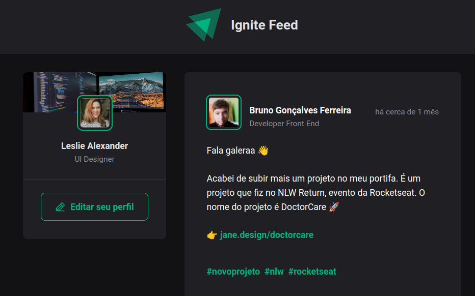

<h2 align="center">Ignite Feed</h2>
<br>

<p align="center">
     <a href="#-tecnologias">Tecnologias</a> • 
     <a href="#-features">Features</a> • 
     <a href="#-como-usar">Como usar</a> •     
     <a href="#-colaboradores">Colaboradores</a> •
     <a href="#-licença">Licença</a> •
</p>

<br>

Ignite Feed, é um projeto que construimos com a Rocketseat no bootcamp Ignite. O Ignite é um programa de aceleração para devs.

<br>

## 🌄 Layout



<br>

## ✅ Features

- [x] Comentar um post
- [x] Excluir um comentário

<br>

## 🛠 Tecnologias

Abaixo tecnologias que foram usadas no projeto

- React
- Javascript
- Html
- Css
- Git e Github
- Vercel

<br>

## 💿 Como usar

### ✅ Pré-requisitos

Antes de começar, você vai precisar ter instalado em sua máquina as seguintes ferramentas:
[Git](https://git-scm.com), [Node.js](https://nodejs.org/en/).
Além disto é bom ter um editor para trabalhar com o código como [VSCode](https://code.visualstudio.com/)

### 🎬 Rodando projeto

```bash
# Clone este repositório
git clone https://github.com/brunogoncalvesferreira/ignite-feed.git

# Acesse a pasta do projeto
cd ignite-feed

# Instale as dependências
npm install

# Start server
npm run dev

# O servidor inciará na porta:3000 - acesse <http://localhost:3000>
```

<br>

## 👨‍💻 Colaboradores

<table>
    <tr>
         <td align="center"><a href="https://brunogoncalvesferreira.com"><br /><sub><b>Bruno Gonçalves</b></sub></a><br /><a href="https://brunogoncalvesferreira.com" title="Bruno Gonçalves Ferreira">👨‍🚀</a></td>
    </tr>
</table>

<br>

## ✅ Licença

[MIT](https://choosealicense.com/licenses/mit/)
